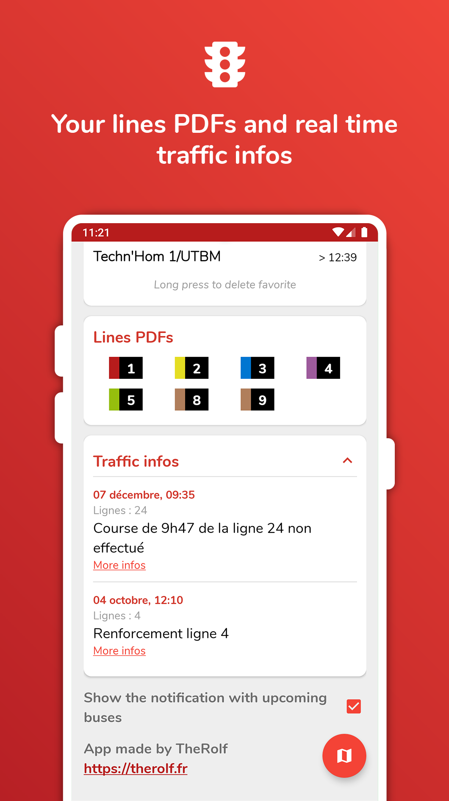

	 
	<h1>OptymoNext</h1>
	
Android app displaying personalized bus information

    
Reverse engineering on urban bus stops service

    

        
        
        
        
    

# Reverse engineering on urban bus stops service

You can read the articles at in the link below: 

- Part 1 : [Get the data](https://therolffr.github.io/optymoNextAndroid/optymo-reverse-engineering-part-1)
- Part 2 : [Structure the data](https://therolffr.github.io/optymoNextAndroid/optymo-reverse-engineering-part-2)
- Part 3 : [Make the app](https://therolffr.github.io/optymoNextAndroid/optymo-reverse-engineering-part-3)

# Releases

All APK are available here: 
[GitHub release page](https://github.com/TheRolfFR/optymoNextAndroid/releases)

# Screenshots

 

