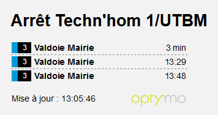
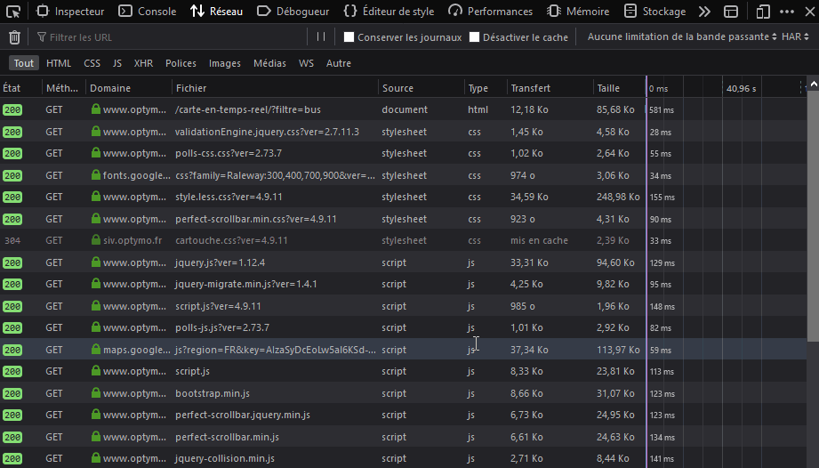
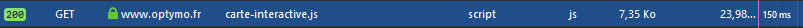
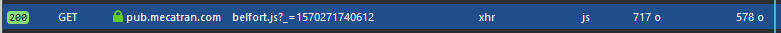
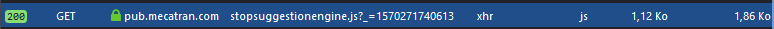
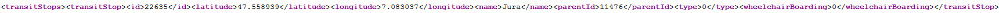
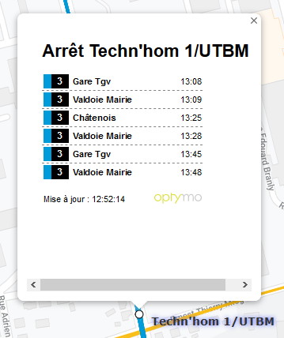
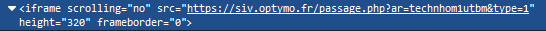

# How I reverse engineered my bus stop service to make my own app: Part 1: Get the data

##Introduction 

I live in Belfort and I do use the [Optymo](https://www.optymo.fr) bus service daily and I need to continuously fastly check at what time the next bus is coming. Unfortunately, nothing but a big PDF with plenty of time tables is given to us to know it. What I needed was a way to instantly check from my notifications the next buses at a given bus stop.

However, the Optymo company has no available API ([Application programming interface](https://en.wikipedia.org/wiki/Application_programming_interface)). I needed to find a way to extract suitable informations such as the next stops, all the stops names and all the lines with the stops.
<br><br>
##The little QR Codes

A QR Codes is available to check the next buses at a given stop. So let's use it. The most interesting data of the web page obtained with this QR code is its URL. It contains a sort of slug telling what is the stop name and an index with the line. However the slug is very irregular and depends a lot on the stop name, which can sometimes be complicated.



Ex: this url [https://siv.optymo.fr/passage.php?ar=Utb01](https://siv.optymo.fr/passage.php?ar=Utb01) whose slug is **Utb01**, has the following name: **Techn'hom 1/UTBM**

I can't waste time searching each slug for each stop and line. I need to find another solution.

##The map

The Optymo website has something really interesting. It includes a Google map with all the integrated stops ([link](https://www.optymo.fr))! But where do these stops come from? let's open the browser network traffic tool:



Wow, there's a lot of traffic! Hard to know what is what but the domain names might help me.

<br>
This sounds cool : "interactive map"?



The bus positions in real time ? Not interesting for me.
```javascript
var srcFileBus = modePrm == "demo" ? "itrsub/get_markers_demo.php" :
					modePrm == "vide" ? "itrsub/get_markers_vide.php" :
						modePrm == "urb" ? "itrsub/get_markers_urb.php" :
							modePrm == "sub" ? "itrsub/get_markers_sub.php" :
								"itrsub/get_markers_urb.php";
```

<br>

What is this script? belfort.js ? There are some API keys, let's see what I can do with them.


<br>

stopsuggestionengine.js ? That's what I am looking for!


Nice! There is a URL that use the API key to get the stops!

`"url" : '//app.mecatran.com/' + apiPath + instance + '?includeStops='+ includeStops +'&amp;includeStations='+ includeStations +'&amp;apiKey=' + apiKey`

<br> Now let's get them! What it this thing?


That might be XML. Let's check the source code of the page. Now this is better!



Yes! Let's download it. I will parse it later to get everything I need. Now I need to know the next bus for a given stop. When I click on a bus stop a tooltip is displayed :



This page looks like the one from the QR code but this one works for all the stops in the same location. The URL may be different. I'll see what it is with the code inspector. Hello my friend!



[https://siv.optymo.fr/passage.php?ar=technhom1utbm&amp;type=1](https://siv.optymo.fr/passage.php?ar=technhom1utbm&amp;type=1) Got it! The URL slug is much easier to guess. It is only alphanumeric characters in lowercase. Now that I have all my URLs and my stops I can start working on the data model for my app. I will be using Android Studio and Java to do it. First I will make a Java desktop project to organize all my data and see how I can achieve my goals.

Thanks for reading.
See you later for the next part.

EDIT 12/30/2019 : The next part is published, go check it our [here](optymo-reverse-engineering-part-2)

EDIT 07/26/2020 : The final part is published, go check it our [here](optymo-reverse-engineering-part-3)