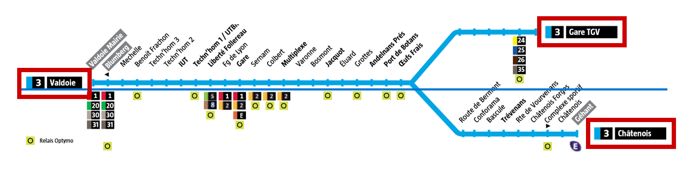

# How I reverse engineered my bus stop service to make my own app: Part 2: Structure the data

Before reading this article, you can check out the previous part [where I got all the necessary data](https://therolf.fr/anchor/index.php/posts/optymo-reverse-engineering-part-1).

Now time for us to structure the data around classes. I discovered many things during this journey. One thing that I truly experienced is the needs define the classes. This is due to the fact that [Object-Oriented Programming](https://en.wikipedia.org/wiki/Object-oriented_programming) is focused on the data approach while [imperative programming](https://en.wikipedia.org/wiki/Imperative_programming) is focused on the processing approach.

What I have currently is data. What I need is to structure them in a way I can use them..

For each class I will have what is relevant to store, then what is relevant to get.

## A stop

First, I need the most basic thing in my network. I need stops. And what does a stop have? A **name** of course and here it’s crucial because the name gives us the [slug](https://en.wikipedia.org/wiki/Slug_(publishing)) which allows us to identify each stop. The last thing we could add is a **list of lines** that are coming to this stop.

What I need to know is the slug for a given stop name. In the previous step, I deduced that a slug has no accents and contains only lowercase alphanumeric characters. From this description I can write the corresponding Java code:

<a id="slugtransformation"></a>

```java
public static String nameToSlug(String stopName) {
    return Normalizer.normalize(stopName, Normalizer.Form.NFD).replaceAll("[^A-Za-z0-9]", "").toLowerCase();
}
```
*Example: “Techn'hom 1/UTBM” =&gt; “technhom1utbm”*

Then what I need to get from a stop is its next times, but I can't explaining without introducing new classes. it is a bit long to explain  here how I got them so for the full explanations [click here](#get-slug).

## A line

Secondly comes the line. Each line is described by a number and the destination of the line. And within a line is a list of stops. I will need these lists for the main part of my application in order to filter on the line and then select a stop in the filtered line. Please note that when I say, “a line”, I am talking of something that has the same number and destination name. The “problem” is that a line has at least 2 directions.



*Here above a typical example of a multi-junction line : a 3 direction line: “[3] Valdoie, [3] Châtenois and [3] Gare TGV”*

## A direction

When I say a direction, I mean what compose a favourite. What you set as a favourite is not only a stop but also the direction you are interested in. Finally, it’s a stop including its *name*, its *slug* but also a *line number* and a *direction*. I need to get these data so I will have [getters](https://en.wikipedia.org/wiki/Mutator_method) do the job.


## A next time

Here a next time is a crucial data and corresponds to the next time a bus is coming for a given direction, as described above. So, it is a *direction* with a “*next time*” string:


## <a id="get-slug"></a>How to retrieve next times for a given stop and a given line and direction 

In the previous step, we saw where I found the data and a webpage. This web page [URL](https://en.wikipedia.org/wiki/URL) contains a [stop slug](#slugtransformation). So first of all, I downloaded the source code of the page.
```html
…
<div class="global"><div class="f1"><span class="cartouche reg ligne_3">3</span></div><div class="f2"><b>Valdoie Mairie</b></div><div class="f3">3 min</div></div>
<div class="global"><div class="f1"><span class="cartouche reg ligne_3">3</span></div><div class="f2"><b>Gare Tgv</b></div><div class="f3">10 min</div></div>
…
```
*The interesting part of the code*

Next I used a [HTML](https://en.wikipedia.org/wiki/HTML) [parser](https://en.wikipedia.org/wiki/Parsing#Parser) [library](https://en.wikipedia.org/wiki/Library_(computing)) ([JSOUP](https://mvnrepository.com/artifact/org.jsoup/jsoup)) in order to convert the downloaded string into a proper “html document” Java object.

This code was written in a static method so that no stop object is necessary to access it. A stop slug is used as a paramater.

Given the example, we can extract our informations by getting the text of each element with the corresponding classes:

- f1: provides the line number
- f2: provides the line direction
- f3: provides the “next time” string

Finally, I can construct my next time object.

And if an error occurs? This is a good question. In case of error, the following page is displayed:


Of course the message is in French! It means “Undefined stop or without data. Please try later”.

The source code of this page has no HTML element with the previous classes. However, This does not mean that the stop doesn’t exist. This response is displayed when the Optymo service is not available, during the **night** or example, or when **no more buses** are coming.

## The network

This class is bigger than all previously described classes. The network class includes all the data with every stop and every line. A network contains a **list of stops** and a **list of lines**. What we need is the whole network or “how to generate a full network with all stops and lines”. Furthermore, I need to fetch a **stop** by a given **slug** or a **line** by its **line number** and its **direction**.

## Network generation process

I will generate this network thanks to the [XML](https://fr.wikipedia.org/wiki/Extensible_Markup_Language) file I already found. But this file includes in addition to urban bus stops also sub-urban stop buses, bike sharing stations and self-service car locations.

I then used the native Java XML parser to get a Java object I can work on.

Now I have to loop through all the “locations” and clean their names and send them to the method where I [get the next times](#get-slug). How to know this is a real stop? That’s the thing, it has to be generated during a weekday in daytime. If I get a result, then it’s a bus stop, I add it and for each next time I get it’s a potential new line where I add my fresh stop. This process is very long and takes up to 20 seconds (fair enough considering the more than 500 “locations” in this file). At the end, I use a [JSON](https://fr.wikipedia.org/wiki/JavaScript_Object_Notation) parser to generate a string I can export to a file.

This generation time is too important for the first launch of the app, so the JSON network file has to be generated in advance.

Improve the network

However, that’s not all folks. Some “big” stops are real hubs in the network, and they have more lines coming through than the number of lines for a next time request. So, I need to improve my network by doing a similar procedure to generate the network.

Eventually, I made a structure that we can use with our application. Now, I “only” have to make the app.

Thanks for reading. See you later for the next part about the app. 

EDIT 07/26/2020 : The final part is published, go check it our [here](optymo-reverse-engineering-part-3)