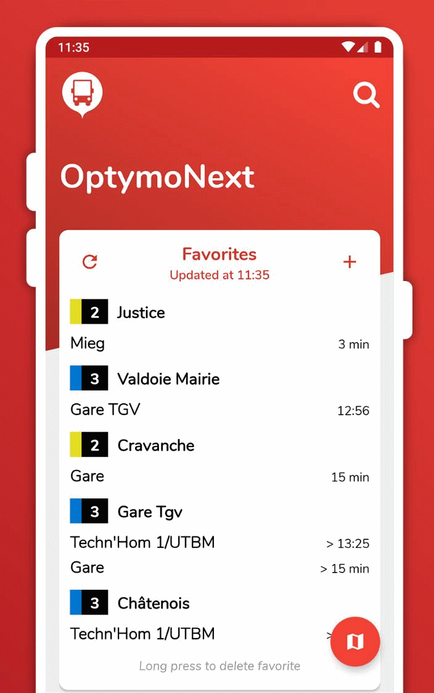

# How I reverse engineered my bus stop service to make my own app: Part 3: Make the app

Before reading this article, you can check out the previous parts where I [found](./optymo-reverse-engineering-part-1) the data and [structured](./optymo-reverse-engineering-part-2) it.

Now time for us to code the app and its functionalities. I had already predefined requirements for this application.

First, you need to be able to save favorite directions. Secondly, you get the next times for this particular direction. Then, all your favorites must be displayed in one notification and on the main screen of the app.

# Disclaimer

I am not a professional and this is my first application. I have no experience whatsoever, so please consider that I could have coded it with low experience in mobile development.

# The mock-up
From my needs, I deduced that we needed at least two screens. One is the main screen with my favorites and the second is where I can add a new favorite. I used [Adobe XD](https://adobe.com/xd) in order to make some mock-ups of what I was looking for.

<iframe width="386" height="720" style="margin: 0 auto;" src="https://www.youtube-nocookie.com/embed/b5ONGQJbBxE" frameborder="0" allow="accelerometer; autoplay; encrypted-media; gyroscope; picture-in-picture" allowfullscreen=""></iframe>

# The right tool
Personally, Java was the way to go. I learned this language at university during the previous semester, so I looked for a way to develop android applications with Java. And it exists. As a result, during summer holidays, I attended an [online course](https://openclassrooms.com/fr/courses/4517166-developpez-votre-premiere-application-android) on how to develop Android application using [Android Studio](https://developer.android.com/studio/) and Java.

The tutorials were quite easy, and I passed the course. However, I discovered later that a personal project makes a huge difference.

# First things first
The first things to are global to the applications so you need to extend the [Application class](https://developer.android.com/reference/android/app/Application?hl=en). I called id [GlobalApplication](https://github.com/TheRolfFR/optymoNextAndroid/blob/master/app/src/main/java/com/therolf/optymoNext/controller/global/GlobalApplication.java) and it does two things.

First, it loads the [pre-generated network JSON file](https://github.com/TheRolfFR/optymoNextAndroid/blob/master/app/src/main/res/raw/network.json) we made so that we could have a network to work with.

Secondly it loads the favorites you saved into a custom [FavoritesController](https://github.com/TheRolfFR/optymoNextAndroid/blob/master/app/src/main/java/com/therolf/optymoNext/controller/global/FavoritesController.java) object.

From there I could display my data in custom views.

# Adapters, adapters everywhere
In the previous part of this article, we saw that we had a lot of lists such as stops lists, next times list. In order to represent these lists in views with Android Studio, we create custom [Adapters](https://developer.android.com/reference/android/widget/BaseAdapter?hl=en). I even had to create [one folder](https://github.com/TheRolfFR/optymoNextAndroid/tree/master/app/src/main/java/com/therolf/optymoNext/vue/adapters) so that I could list all of them. An adapter is the link between the data and the item view of the application. For each adapter, I created a view in the [resource layout folder](https://github.com/TheRolfFR/optymoNextAndroid/tree/master/app/src/main/res/layout). Based on my [mock-up](#the-mock-up) and thanks to the styling similar to [CSS](https://en.wikipedia.org/wiki/Cascading_Style_Sheets), I was able to replicate what I sketched.

# Asynchronous requests not on the same thread
All the next times for the directions must be fetched online via the [NetworkController](https://github.com/TheRolfFR/optymoNextAndroid/blob/master/app/src/main/java/com/therolf/optymoNext/controller/global/NetworkController.java) object and its [OptymoNetwork](https://github.com/TheRolfFR/optymoNextAndroid/blob/master/app/src/main/java/com/therolf/optymoNextModel/OptymoNetwork.java) attribute. However, you cannot use the main thread to make these requests else, you will block the execution of your application. Thus, I spent most of the time doing asynchronous requests and updating my lists with my result. I used [AsyncTask](https://developer.android.com/reference/android/os/AsyncTask.html) (even if they are better solutions), in order to execute methods of my network controller object and then handled the result to update the adapters.

# The notification
The whole goal of this app was to access the favorites from a notification. I had to dig deep down in documentation in order to achieve a satisfactory result. We cannot see all the favorites on one notification due to the fact that they have a maximum height. I needed to make "pages" and navigate between "pages". As a result, we will have two buttons: one to navigate to the next page, the other to refresh it. The notification must indicate the line number, the line direction and the next time. Here is the final result:

I had some serious problems because the number of elements available for a notification and their options are limited. For example, you cannot change dynamically the background color of an element. So, in order to recolor the line number's colored border, I put a square character inside a text box and increased the font size. Now I can dynamically change its text color at will.

Another problem was the text color. The application is compatible until android 4.4 but the notification color is white on black background. In more recent versions, the notification color is black on white background and finally with the dark theme, the notification is white on black background. I finally found a text appearance doing it automatically: _@style/TextAppearance.Compat.Notification_.

# The main screen
There were many iterations to create the main screen. I made a lot of designs, tested them with friends but finally came to a really satisfying result, both practical and pretty.

## Top of the screen

At the top of the main screen, we have the logo application and the search button, opening the search bar to get quick access to a stop or line. But I will get to that [later](#search-menu). Then we have the name of the app. The design hack is the diagonally cut gradient background going under the favorite list. In order to achieve this effect, I made a transparent image already cut and I put a negative horizontal margin on the title to reduce the component height and voilà!

## Favorites panel

Then comes the big stuff. You have two important buttons on the top of this panel. The first is the refresh button (1), allowing you to refresh the next times of your favorites. When hit, it updates the last refresh time and renders the new list received. The second is the add button (2), where you can access a screen to add a new favorite. I will detail it later.

In the centre of the panel is the list with the next times. This list is rendered when the application is first opened and wan be refreshed with the refresh button or by swiping up to the top of the screen, displaying the refresh spinner. The adapter item associated to this list is made of two elements. The first is the number and name of the line (3). The second is an adapter containing the next favorite stops for this line in particular (4). When the list is refreshed, I check if the line was rendered. If not, I create the item. Once I found the item, I can update the adapter inside the adapter with my next time. The stops are then sorted by descending date. If you long press the next time, a confirmation dialog will ask you if you want to delete the favorite.

## Line PDFs panel

This feature was an idea from friends. I tried to make it compact, so I only left the badges with their respective colors:

The adapters item has a direct link to the official Optymo website PDF and opens it in your native PDF application. If you do not have a PDF application, he will open your browser to the PDF link. Unfortunately, not every line is included, and I handwrote the links, so it is definitely that could be easily improved.hand

## Traffic infos panel

This panel was a last-minute feature and I thought it was an excellent idea. The panel is initially collapsed and not loaded. When the user presses the title, a progress spinner appears inside the panel until the traffic infos are processed and displayed. Getting information was quite easy due to the fact that the website offers the traffic infos as an [RSS feed](https://en.wikipedia.org/wiki/RSS). I just extracted it and put it inside a custom [TrafficInfo](https://github.com/TheRolfFR/optymoNextAndroid/blob/29d36870d2f87f0e90f2e401953ff1653c0f1206/app/src/main/java/com/therolf/optymoNext/vue/adapters/TrafficAdapter.java#L140-L152) object and updated the infos' adapter.

## Bottom of the screen

Due to the fact that I do not have and need any settings screen, I decided to put everything else at the bottom. I placed a checkbox to enable/disable the notification. I also added some credits to the app with a link to my website.

## Floating map button

The button with the card icon is actually not at the bottom of the screen, it is staying to the bottom right part of the phone screen even when the user scrolls. It allows a quick and effective access to the real-time bus map.

## Search menu

When the search button is pressed, it opens the search menu, with the keyboard. It allows the user to find easily lines or stops. I made the search smart so that if you type a number, it will search the stops with this number included, but also the lines associated to this number. However, you have to type two letters to start a new search.

# The favorite screen

The favorite screen is actually very simple. Thanks to the network I created earlier, I can get all the lines and all the stops for a line direction. First, you choose you line direction with the option menu. I made a custom option menu with the standard style to represent them. They are sorted by line number and then by line direction. When chosen, the second option menu is updated with the corresponding stops and you can select it. Eventually, you can submit by pressing the "add" button.

# The map screen

The map screen was a feature I really wanted to implement, and I had all the information necessary. And I was quite surprised with the final result. It is fast, native, and really easy to use. The colored lines represent the lines, the white dots the bus stops and the colored buses, the actual buses moving across the city. If you touch a white dot, you will get its name and you can touch the name to get the next times for this particular stop. If you touch a bus icon, you will get its direction, ID number and the date when its position was retrieved. The bus positions are refreshed every 10s.

The location button on the top left allows you to know where you are on the map. The location request is made [exclusively](https://github.com/TheRolfFR/optymoNextAndroid/blob/29d36870d2f87f0e90f2e401953ff1653c0f1206/app/src/main/java/com/therolf/optymoNext/controller/activities/Map/MyLocationController.java#L26-L31) when you pressed the button. When received, the camera moves, and a blue icon is displayed.

# Final result

I may be a beginner, but I thought this was a great experience and I learned a lot from this journey. It is far different from theory. I made something quite cool and useful with a unique style. Even my friends seem very happy with the result.

I never published this application because it was only to meet my personal needs and there is so many rules/problems/bans with the Play Store that I do not have the time and courage to face them.

However, if you are interested in the code or the app, you can find the GitHub page with releases included:

[https://github.com/TheRolfFR/optymoNextAndroid](https://github.com/TheRolfFR/optymoNextAndroid)

Thanks for reading. I hope you enjoyed the articles as I enjoyed writing them. Don't hesitate to contact me or leave a comment if you want to discuss it further.